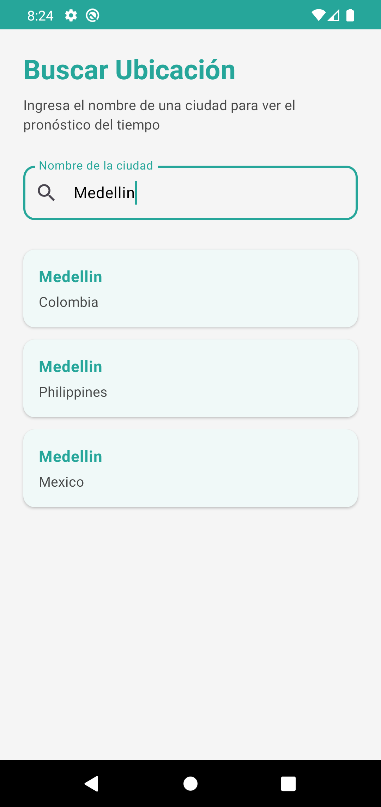
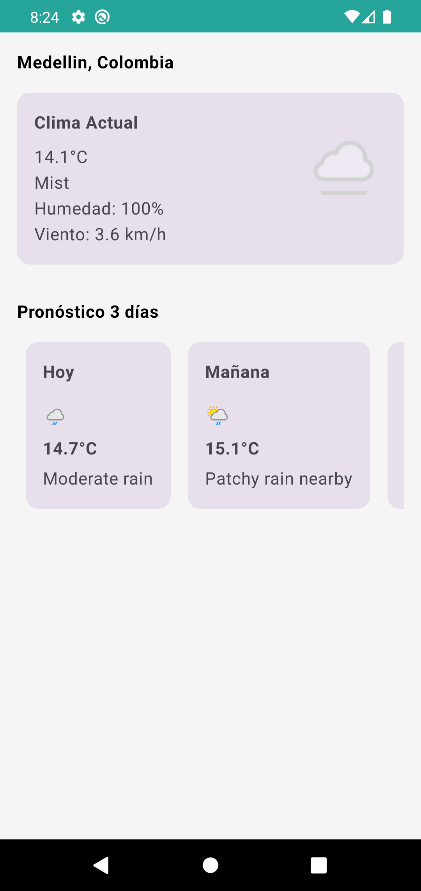

# Weather Challenge Bold

Aplicación móvil Android desarrollada para consultar el clima actual y pronóstico del tiempo de diferentes ubicaciones utilizando la API de WeatherAPI.

## Capturas de Pantalla

### Pantalla de Búsqueda


La pantalla de búsqueda permite buscar ubicaciones en tiempo real mientras el usuario escribe.

### Pantalla de Pronóstico


La pantalla de pronóstico muestra el clima actual y el pronóstico para los próximos 3 días.

## Características

- Búsqueda de ubicaciones en tiempo real mientras el usuario escribe
- Visualización del clima actual con información detallada
- Pronóstico del tiempo para los próximos 3 días
- Soporte para cambio de orientación de pantalla
- Interfaz moderna desarrollada con Jetpack Compose
- Arquitectura limpia con separación de responsabilidades

## Requisitos del Sistema

- Android Studio Hedgehog o superior
- JDK 17
- Android SDK mínimo: 21 (Android 5.0 Lollipop)
- Android SDK objetivo: 34

## Estructura del Proyecto

El proyecto sigue una arquitectura limpia dividida en tres módulos principales:

### Módulo Domain
Contiene la lógica de negocio y modelos de dominio:
- Modelos de datos (Location, WeatherForecast, etc.)
- Interfaces de repositorios
- Casos de uso (Use Cases)

### Módulo Data
Implementa la capa de datos:
- DTOs para mapear respuestas del API
- Implementación de repositorios
- Servicios de API con Retrofit
- Configuración de inyección de dependencias

### Módulo App
Contiene la capa de presentación:
- ViewModels con patrón MVVM
- Pantallas desarrolladas con Jetpack Compose
- Navegación con Navigation Compose
- Temas y estilos

## Tecnologías Utilizadas

- **Kotlin**: Lenguaje de programación principal
- **Jetpack Compose**: Framework de UI declarativa
- **Hilt**: Inyección de dependencias
- **Retrofit**: Cliente HTTP para consumo de APIs
- **Coroutines**: Programación asíncrona
- **Navigation Compose**: Navegación entre pantallas
- **Material 3**: Sistema de diseño
- **Coil**: Carga de imágenes

## Configuración e Instalación

1. Clonar el repositorio:
```bash
git clone <repository-url>
cd WeatherChallengeBold
```

2. Abrir el proyecto en Android Studio

3. Sincronizar las dependencias de Gradle (Android Studio lo hará automáticamente)

4. Ejecutar la aplicación en un dispositivo o emulador Android

## Construcción del Proyecto

Para construir el proyecto desde la línea de comandos:

```bash
./gradlew assembleDebug
```

Para instalar en un dispositivo conectado:

```bash
./gradlew installDebug
```

Para ejecutar las pruebas unitarias:

```bash
./gradlew test
```

Para ejecutar las pruebas de instrumentación:

```bash
./gradlew connectedAndroidTest
```

## Uso de la Aplicación

1. Al iniciar la aplicación, se muestra una pantalla de bienvenida (Splash Screen)

2. En la pantalla de búsqueda, ingrese el nombre de una ubicación en el campo de texto

3. Los resultados aparecerán automáticamente mientras escribe

4. Seleccione una ubicación de la lista para ver el pronóstico del tiempo

5. La pantalla de pronóstico muestra:
   - Información del clima actual (temperatura, condición, humedad, viento)
   - Pronóstico para los próximos 3 días con temperatura promedio y condiciones

## API Utilizada

La aplicación utiliza WeatherAPI (https://www.weatherapi.com/) para obtener datos meteorológicos.

Endpoints utilizados:
- Búsqueda de ubicaciones: `/v1/search.json`
- Pronóstico del tiempo: `/v1/forecast.json`

## Pruebas

El proyecto incluye pruebas unitarias para los casos de uso y pruebas de instrumentación para las pantallas principales.

### Ejecutar Pruebas Unitarias
```bash
./gradlew test
```

### Ejecutar Pruebas de Instrumentación
```bash
./gradlew connectedAndroidTest
```

## Arquitectura

La aplicación implementa Clean Architecture con las siguientes capas:

- **Presentation**: ViewModels y Composables
- **Domain**: Casos de uso y modelos de negocio
- **Data**: Repositorios y fuentes de datos

El flujo de datos sigue el patrón MVVM:
1. El usuario interactúa con la UI (Composable)
2. La UI llama a métodos del ViewModel
3. El ViewModel ejecuta casos de uso
4. Los casos de uso utilizan repositorios
5. Los repositorios obtienen datos del API
6. Los datos fluyen de vuelta a la UI a través de StateFlow

## Manejo de Errores

La aplicación maneja errores de manera elegante:
- Errores de red se muestran al usuario con mensajes claros
- Validación de entrada en tiempo real
- Estados de carga durante operaciones asíncronas

## Soporte de Orientación

La aplicación soporta cambios de orientación de pantalla. Los datos se preservan durante la rotación gracias al uso de ViewModels y SavedStateHandle.

## Licencia

Este proyecto fue desarrollado como parte de un challenge técnico.

